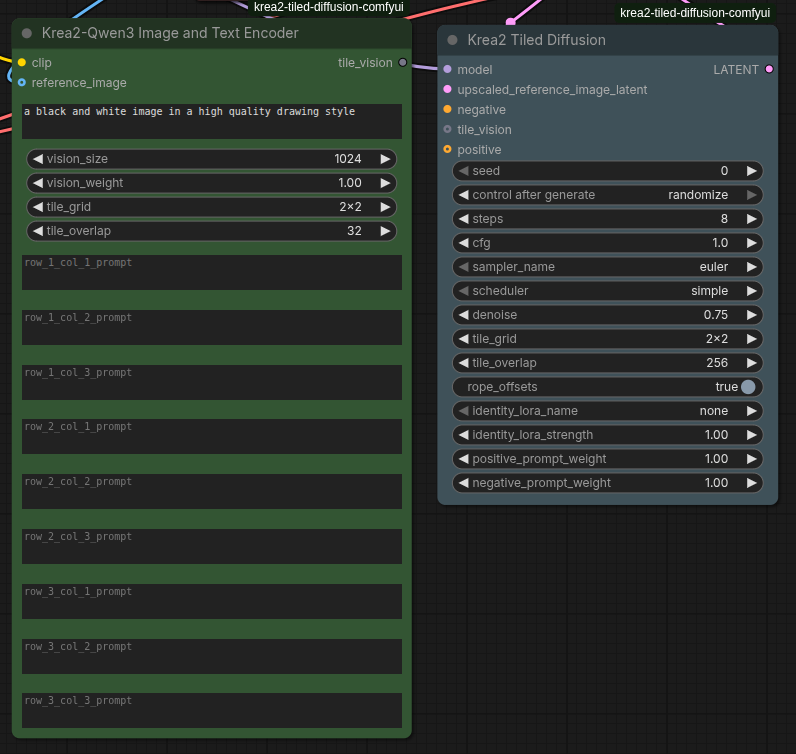
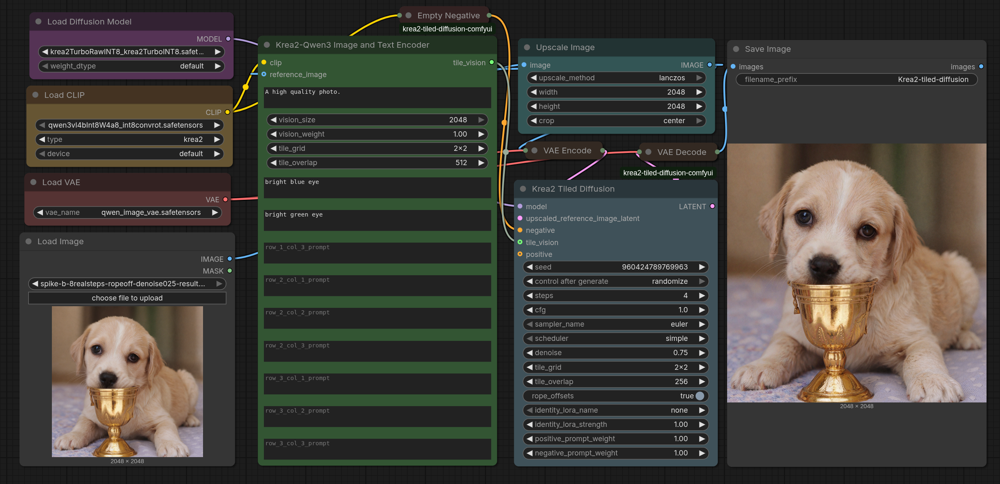

# Krea 2 Tiled Diffusion



**High-resolution detail passes for Krea 2 that don't grow a second head — and run on consumer VRAM.**

The model only ever sees one tile, so peak memory follows the **tile**, not the
canvas. Need a bigger image? Raise the grid, not the VRAM.

---

## Why it holds together

**Tiles fuse every step.** Others denoise each tile to completion, then blend the
finished tiles — too late, they already disagreed. Here all tiles run the *same*
step and recombine before it returns, under a raised cosine weight. Neighbours
can't drift because neither gets ahead.

**Each tile sees only its own region.** The vision tower reads that tile's crop.
Show a tile the whole composition and you've told it to *draw* the whole
composition — that's where the spare torso comes from.

**The prompt matters.** Per-tile content arrives through vision, so you can't
describe all aspects of the image in the main prompt. There are fields per tile 
you can use to correct issues that arise, but generally you should only put 
style/quality prompting that applies to all tiles:

```
a black and white image in a high quality drawing style
```
---

## Results

2x2 at 2048², four steps. Input left, output right.

| before | after |
|--------|-------|
|  |  |

---

## Recipes

| | **detail pass** | **rebuild** | **low VRAM** |
|---|---|---|---|
| grid | 2x2 | 2x2 | 3x3 |
| overlap | 256px | 256px | 256px |
| steps | 4 | 8 | 4 |
| denoise | 0.10 | 0.75 | 0.10 |
| evals / step | 4 | 4 | 9 |
| | sharpens what's there | redraws at high res | smaller tiles, bigger canvas |

Shared: **euler**, **simple**, cfg **1**, RoPE offsets **on**. Turbo model or LoRA.

`vision_weight` **1.0** is enough; up to **8.0** tightens adherence. Both usable.

Pick a denoise — 0.10 and 0.75 are different jobs, the middle is worse than either.

Overlap can go far below 256. Per-tile vision holds one coherent figure at **32px**
seams, where whole-image conditioning splits the same seed into three figures.

---

## Workflow



[`workflows/krea2 tiled diffusion.json`](workflows/krea2%20tiled%20diffusion.json)
opens and runs.

```
Load Image ──> Upscale ──┬──> VAE Encode ──> Tiled Diffusion (latent)
                         └──> Encoder (reference_image) ──> tile_vision ──┘
Empty CLIPTextEncode ────────────────────────> Tiled Diffusion (negative)
```

1. **`reference_image` and the latent are the same pixels** — feed both from one
   node, after any resizing.
2. **Leave `positive` unwired.** Each tile brings its own conditioning.
3. **`negative` is required** — an empty `CLIPTextEncode`.

Set `tile_grid` and `tile_overlap` on the **encoder**; the sampler adopts them.

**Stays in latent space.** No resizing, cropping, or VAE in either node — latent
in at target resolution, latent out. Drops straight into a hires chain with no
pixel round trip. ComfyUI's own nodes handle upscaling and encoding.

---

## Per-tile prompts

Nine fields on a fixed 3x3 grid, so labels stay readable at any tile grid — a 2x2
uses `(1,1) (1,2) (2,1) (2,2)`.

Each tile encodes `global prompt, tile prompt` with its own crop, in one pass.
Put `bright green eye` in one field and only that quadrant hears it.

---

## Requirements

- ComfyUI with native Krea 2 support (`comfy/ldm/krea2/`)
- **Diffusion model** — `krea2TurboRawINT8_krea2TurboINT8` (INT8, ~12 GB) runs
  well. A base Krea 2 model plus a turbo LoRA (`krea2_raw_to_turbo_r256`) also
  works.
- **Text encoder** — `qwen3vl4bInt8W4a8_int8convrot` (~5 GB). Smaller quantised
  qwen3vl_4b builds are fine.
- **Identity edit LoRA**, optional, loads in-node — the smallest v1.2 rank,
  `krea2_identity_edit_v1_2_r64` (~436 MB), works well.

## License

MIT. See [LICENSE](LICENSE).
